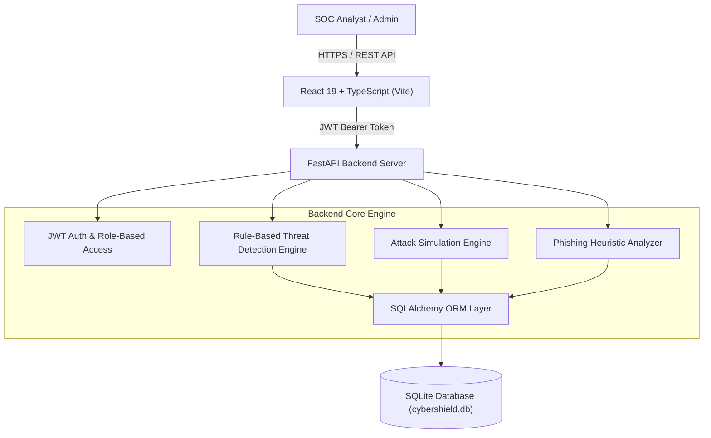

# 🛡️ CyberShield: Academic SOC & Cybersecurity Simulation Platform

[](https://fastapi.tiangolo.com/)
[](https://react.dev/)
[](https://www.typescriptlang.org/)
[](https://www.sqlite.org/)
[](LICENSE)

**CyberShield** is an enterprise-grade academic Laboratory Security Operations Center (SOC) platform and attack simulation framework. It provides real-time security event telemetry processing (SIEM), an automated rule-based threat detection engine, multi-stage attack simulation vectors, digital forensics artifact management, AI-assisted phishing email analysis, and a structured 6-stage Incident Response (IR) lifecycle manager following NIST/SANS standards.

---

## 📑 Table of Contents
1. [Key Features & Capabilities](#-key-features--capabilities)
2. [System Architecture](#-system-architecture)
3. [Prerequisites](#-prerequisites)
4. [Step-by-Step Installation & Setup Guide](#-step-by-step-installation--setup-guide)
   - [Backend Setup (FastAPI)](#1-backend-setup-fastapi)
   - [Frontend Setup (React + Vite)](#2-frontend-setup-react--typescript--vite)
5. [Pre-seeded Test Accounts](#-pre-seeded-test-accounts)
6. [API Endpoints Overview](#-api-endpoints-overview)
7. [Environment Configuration](#-environment-configuration)
8. [Directory Structure](#-directory-structure)
9. [Troubleshooting & FAQs](#-troubleshooting--faqs)

---

## 🔥 Key Features & Capabilities

### 1. 📊 Executive SOC Dashboard
* Real-time metrics tracking active alerts, open incidents, and monitored lab assets.
* Live security event telemetry stream with status badges (`UNPROCESSED`, `PROCESSED`, `DETECTED`).
* Asset topology health & risk level monitoring (`LAB-WEB-01`, `LAB-AUTH-01`, `LAB-DB-01`, `LAB-PC-01`).

### 2. ⚔️ Multi-Vector Attack Simulator
* **Brute Force SSH Attack**: Generates rapid password failure telemetry targeting `LAB-AUTH-01` (`192.168.10.20`) with `/var/log/auth.log` evidence dumps.
* **Port Scan Reconnaissance**: Probes multi-service ports (`21, 22, 80, 443, 1433, 3306, 8080`) targeting `LAB-WEB-01`.
* **Phishing Campaign**: Injects credential harvesting attack events and malicious destination link samples.
* **Suspicious Login Anomaly**: Simulates off-hours logins originating from untrusted locations.
* **Malware Hash Indicator**: Injects ransomware/dropper SHA-256 signatures into host telemetry.
* **Automated Scenarios**: Executable multi-stage attack chains with animated progress terminal UI.

### 3. 🧠 Rule-Based Threat Detection Engine
Evaluates synthetic security events against configurable thresholds:
* **Rule 1 (Brute Force)**: > 5 failed authentication attempts from a single source IP.
* **Rule 2 (Port Scan)**: > 4 distinct service ports probed by a single source IP.
* **Rule 3 (Suspicious Login)**: Anomalous user logins from unassigned external IPs.
* **Rule 4 (Malware Match)**: Known malicious payload hash signatures detected on host endpoints.
* **Rule 5 (Phishing Click)**: Endpoint user interaction with verified phishing URLs.

### 4. 🚨 Incident Response Framework (NIST 6-Stage IR)
* Guides analysts through **Detect -> Triage -> Contain -> Investigate -> Eradicate -> Recover -> Lessons Learned**.
* **Automated Containment Playbooks**:
  * 🛑 **Isolate Asset**: Disconnects endpoint from simulated network topology.
  * 🚫 **Block Attacker IP**: Configures simulated firewall drop rules.
  * 🔑 **Force Password Reset**: Invalidates compromised user credentials.
  * 🎟️ **Revoke Token**: Terminates active JWT session tokens.
* Investigator notes collaboration trail with timestamps.

### 5. 🔬 Digital Forensics & Chain of Custody
* Repository of forensic evidence (`AUTH_LOG`, `NETWORK_PCAP`, `PROCESS_MEMORY`, `FILE_METADATA`, `BROWSER_HIST`, `SYSTEM_EVENT`).
* Integrates SHA-256 / MD5 payload hash verification and raw log inspection.

### 6. 🎣 AI-Assisted Phishing Email Analyzer
* Heuristic NLP email risk analyzer computing risk scores (0-100).
* Checks domain mismatch/spoofing, urgency language, credential harvesting prompts, and suspicious links (`bit.ly`, raw IPs).
* Generates actionable SOC mitigation steps.

### 7. 🔒 Security Governance & Audit Logs
* Immutable user action audit logging (logins, simulation launches, containment execution).
* Role-Based Access Control (RBAC) supporting `ADMIN`, `SECURITY_ANALYST`, and `FORENSIC_INVESTIGATOR`.

---

## 🏗️ System Architecture



---

## 📋 Prerequisites

Ensure your environment meets the following requirements before installation:

* **Python**: Version `3.10` or higher ([Download Python](https://www.python.org/downloads/))
* **Node.js**: Version `18.0.0` or higher ([Download Node.js](https://nodejs.org/))
* **Package Managers**: `pip` (bundled with Python) and `npm` (bundled with Node.js)
* **Git**: Recommended for managing repository updates.

---

## 🚀 Step-by-Step Installation & Setup Guide

### 1. Clone / Extract the Repository
```bash
git clone <repository-url> CyberShield
cd CyberShield
```

---

### 2. Backend Setup (FastAPI)

1. **Open terminal** and enter the `backend` folder:
   ```bash
   cd backend
   ```

2. **Create a Virtual Environment** *(recommended)*:
   * **Windows (PowerShell)**:
     ```powershell
     python -m venv venv
     .\venv\Scripts\activate
     ```
   * **Linux / macOS**:
     ```bash
     python3 -m venv venv
     source venv/bin/activate
     ```

3. **Install Python Dependencies**:
   ```bash
   pip install -r requirements.txt
   ```

4. **Launch the FastAPI Server**:
   ```bash
   python main.py
   ```
   *Or launch using Uvicorn directly:*
   ```bash
   uvicorn main:app --reload --host 0.0.0.0 --port 8000
   ```
   * **API Base URL**: `http://localhost:8000`
   * **Interactive OpenAPI Swagger Docs**: `http://localhost:8000/docs`

---

### 3. Frontend Setup (React + TypeScript + Vite)

1. **Open a second terminal** and navigate to the `frontend` directory:
   ```bash
   cd frontend
   ```

2. **Install Node.js Dependencies**:
   ```bash
   npm install
   ```

3. **Start Development Server**:
   ```bash
   npm run dev
   ```

4. **Access Application**:
   Open your browser and navigate to: `http://localhost:5173`

---

## 🔑 Pre-seeded Test Accounts

When starting `main.py`, the backend automatically seeds initial assets, events, vulnerabilities, and test operator accounts into `cybershield.db`:

| Role | Email | Password | Allowed Modules |
| :--- | :--- | :--- | :--- |
| **Security Analyst** | `analyst@cybershield.local` | `analyst123` | Dashboard, Events, Alerts, Incidents, Simulator |
| **Administrator** | `admin@cybershield.local` | `admin123` | Full access across all modules + Audit logs & Settings |
| **Forensic Investigator** | `investigator@cybershield.local` | `forensics123` | Digital Forensics, Evidence Repository, Log Analysis |

---

## 🔌 API Endpoints Overview

| Module | Method | Endpoint | Description |
| :--- | :--- | :--- | :--- |
| **Auth** | `POST` | `/api/auth/login` | Authenticate user & receive JWT token |
| **Auth** | `GET` | `/api/auth/me` | Fetch current user session details |
| **Dashboard** | `GET` | `/api/dashboard/summary` | Get aggregated SOC metrics & asset status |
| **Assets** | `GET` | `/api/assets` | List lab network assets & risk scores |
| **Events** | `GET` | `/api/events` | Query raw security telemetry log events |
| **Alerts** | `GET` | `/api/alerts` | Retrieve auto-generated threat alerts |
| **Alerts** | `PATCH` | `/api/alerts/{id}/status` | Update alert triage status |
| **Incidents** | `GET` | `/api/incidents` | List open/closed security incidents |
| **Incidents** | `POST` | `/api/incidents` | Escalate alert or create new incident |
| **Incidents** | `POST` | `/api/incidents/action` | Execute automated IR containment playbook |
| **Simulations**| `POST` | `/api/simulations/run` | Run single-vector attack simulation |
| **Simulations**| `POST` | `/api/simulations/scenarios/run` | Run full multi-stage attack scenario |
| **Forensics** | `GET` | `/api/forensics/evidence` | Fetch digital forensic evidence records |
| **Phishing** | `POST` | `/api/phishing/analyze` | Submit email text for heuristic risk analysis |
| **Audit Logs** | `GET` | `/api/audit-logs` | Retrieve operational audit log history |

---

## ⚙️ Environment Configuration

Backend configuration can be customized using environment variables or a `.env` file in the `backend/` directory:

```env
# backend/.env
SECRET_KEY="cybershield-secret-key-soc-platform-2026-academic-lab"
DATABASE_URL="sqlite:///./cybershield.db"
ALGORITHM="HS256"
ACCESS_TOKEN_EXPIRE_MINUTES=1440
```

---

## 📁 Directory Structure

```
Cybersecurity_project/
├── backend/
│   ├── main.py              # FastAPI application entrypoint & REST routes
│   ├── models.py            # SQLAlchemy database ORM models
│   ├── database.py          # Database connection engine & session dependency
│   ├── auth.py              # JWT authentication & password hashing
│   ├── detection_engine.py  # Rule-based threat detection engine
│   ├── attack_simulator.py # Multi-vector attack generator & scenarios
│   ├── phishing_analyzer.py# Email phishing NLP heuristic analyzer
│   ├── seed_data.py         # Initial database seeder
│   └── requirements.txt     # Python backend dependencies
├── frontend/
│   ├── src/
│   │   ├── api/             # Axios API client setup
│   │   ├── components/      # Reusable UI components & modals
│   │   ├── context/         # AuthContext provider
│   │   ├── pages/           # SOC pages (Dashboard, Incidents, Forensics, etc.)
│   │   ├── types/           # TypeScript interfaces & definitions
│   │   ├── App.tsx          # App routing & root layout
│   │   └── main.tsx         # React application entrypoint
│   ├── package.json         # Frontend Node.js dependencies & scripts
│   └── vite.config.ts       # Vite configuration
├── requirements.txt         # Root Python requirements file
└── README.md                # Project setup & technical documentation
```

---

## ❓ Troubleshooting & FAQs

* **Port 8000 is already in use**:
  Run Uvicorn on a custom port:
  ```bash
  uvicorn main:app --reload --port 8080
  ```
  Then update `frontend/src/api/client.ts` to reference `http://localhost:8080/api`.

* **Database Reset / Re-seeding**:
  If you want to reset the database to clean seed state:
  1. Stop the backend server.
  2. Delete `backend/cybershield.db`.
  3. Restart `python main.py`. SQLite will recreate all tables and re-populate fresh seed data.

* **ModuleNotFoundError in Python**:
  Ensure your virtual environment is activated and run `pip install -r requirements.txt`.

---

## 📄 License

This project is open-source under the MIT License. Developed for Academic SOC Threat Simulation & Cybersecurity Education.
